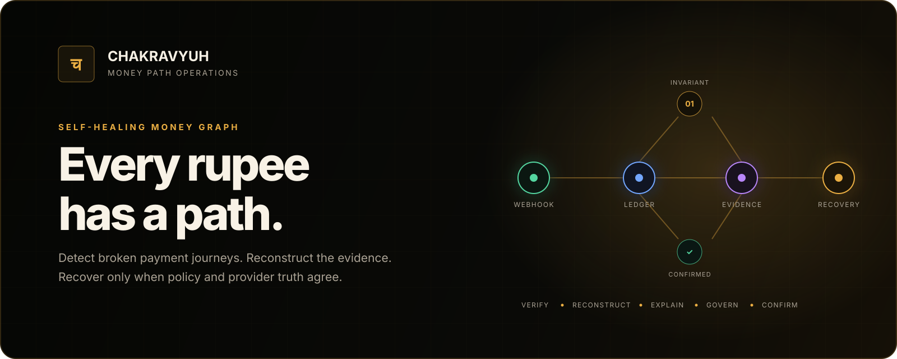

<div align="center">



<br />

**A self-healing money graph for payment revenue recovery.**

Chakravyuh reconstructs incomplete Razorpay payment journeys, grounds diagnosis in connected
evidence, and permits recovery only through deterministic policy and independent approval.

[Open the product](https://chakravyuh-web.vercel.app) ·
[Run a Test Mode payment](https://chakravyuh-web.vercel.app/payments/authorize) ·
[Inspect verified recovery](https://chakravyuh-web.vercel.app/recoveries/verified) ·
[Trace an identifier](https://chakravyuh-web.vercel.app/trace) ·
[Review scale evidence](https://chakravyuh-web.vercel.app/judge)

</div>

---

## Why Chakravyuh exists

A payment can look successful at checkout while revenue silently stops between authorization,
capture, order state, the merchant ledger, and downstream services. Each component may be locally
correct; no component owns the complete journey.

Blind retries are not a safe answer. They can duplicate actions, act on stale state, or recover the
wrong amount. Chakravyuh treats revenue recovery as a **distributed-systems correctness problem**:

1. verify signed provider evidence;
2. reconstruct the complete temporal payment journey;
3. detect missing or contradictory transitions deterministically;
4. explain the smallest relevant evidence subgraph;
5. apply a deterministic action policy and independent approval; and
6. count recovery only after authoritative provider confirmation.

> **AI can explain the evidence. It never receives the keys and cannot move money.**

Built for **Razorpay Buildathon · Track 3: AI Revenue Recovery**.

## Product walkthrough

The primary journey creates a real ₹10 Razorpay **Test Mode** authorization and follows that exact
payment through detection, diagnosis, governance, capture, and webhook-confirmed resolution.

| Surface | Purpose |
| --- | --- |
| [Run payment](https://chakravyuh-web.vercel.app/payments/authorize) | Create the controlled Test Mode authorization and watch its state change |
| [Money trace](https://chakravyuh-web.vercel.app/trace) | Resolve a payment, order, event, journey, or incident identifier |
| [Verified recovery](https://chakravyuh-web.vercel.app/recoveries/verified) | Compare authoritative before/after provider snapshots and inspect receipts |
| [Operations](https://chakravyuh-web.vercel.app/operations) | Explore the incident queue and bounded evidence mesh |
| [Recovery Arena](https://chakravyuh-web.vercel.app/judge) | Challenge held-out evaluation, baselines, chaos outcomes, and proof hashes |
| [Failure recovery](https://chakravyuh-web.vercel.app/payments/recover-failure) | Follow a failed payment into one governed, expiring payment-link recovery |

The public walkthrough keeps scoped provider authority on the server and never asks the browser for
an operator token.

## How it works

```mermaid
flowchart LR
    RP["Razorpay signed webhook"] --> IN["Durable webhook inbox"]
    IN --> PG["Append-only PostgreSQL ledger"]
    PG --> NR["Canonical normalizer"]
    NR --> TR["Full-history temporal reducer"]
    TR --> IV["Deterministic invariants"]
    TR --> GP["Rebuildable Neo4j projection"]
    IV --> EM["Bounded evidence mesh"]
    GP --> EM
    EM --> AI["Grounded AI diagnosis"]
    IV --> DP["Deterministic recovery policy"]
    AI -. "cited recommendation" .-> DP
    DP --> MC["Maker-checker approval"]
    MC --> PF["Authoritative provider preflight"]
    PF --> EX["Exact bounded action"]
    EX --> CF["Signed webhook confirmation"]
    CF --> PG

    AI -. "no credentials · no tools" .-> STOP["Cannot execute"]
```



### Recovery contract

- **Truth:** PostgreSQL stores immutable provider events and content-hashed journey revisions.
- **Order:** journeys are reduced from full event history using event time and stable tie-breakers,
  not arrival order.
- **Detection:** conservative invariants—not an LLM—own incident truth.
- **Graph:** Neo4j is a rebuildable projection for connected evidence, never the source of truth.
- **Diagnosis:** the model receives a bounded allowlisted graph and must return schema-valid claims
  with real citations.
- **Authority:** the server derives the target, action, currency, and exact amount from immutable
  evidence; the model cannot choose them.
- **Approval:** a proposal maker cannot approve their own money-moving action.
- **Execution:** current provider state is fetched again before action; a persisted mutation
  checkpoint prevents blind retries after ambiguous failure.
- **Confirmation:** revenue is credited only after an authoritative signed provider webhook.

## Safety boundary

| Concern | Control |
| --- | --- |
| Forged webhook | HMAC verification over the exact raw body before JSON parsing |
| Duplicate delivery | Provider event identity plus payload-conflict detection |
| Delayed/out-of-order events | Full-history replay with stable ordering and immutable revisions |
| Hallucinated diagnosis | Strict schema, bounded evidence, mandatory citations, deterministic guard |
| Unsafe model action | No tools, credentials, endpoints, or execution capability exposed to AI |
| Wrong target or amount | Server-derived proposal plus exact ID/status/currency/amount preflight |
| Self-approval | Distinct maker and checker principals with scoped authority |
| Timeout after mutation | Mutation-started checkpoint; reconcile by fetch, never blind retry |
| Duplicate capture/link | Stable idempotency identity and stored provider execution receipt |
| Dependency degradation | Bounded retries, visible dead letters, health gates, and fail-closed policy |

## Evidence, not claims

Results are deliberately separated by evidence class. Provider-backed rows use Razorpay Test Mode;
arena and load rows are deterministic synthetic evaluations and are **not merchant revenue claims**.

| Evidence class | Verified result |
| --- | --- |
| Razorpay Test Mode | One real hosted-checkout authorization recovered by exact capture and confirmed by signed `payment.captured` webhook |
| Capture Recovery Arena | 10,005 held-out journeys; 4,002 expected incidents detected; 457 eligible captures selected; 402 provider-confirmed recoveries; **0 incorrect actions** |
| Unsafe retry-all baseline | Same gross recovered value, but 3,545 incorrect actions and **−₹197,220** net value under the locked cost model |
| Chakravyuh policy | **₹148,140** retained value after explicit checker cost under the same locked model |
| Live AI sample | 100 calls; 99 accepted responses; 1 deterministic guard intervention; **0 unsafe effective decisions**; $0.127755 accounted cost |
| Signed ingress and pipeline | 100,000 unique signed events + 10,000 confirmed redeliveries converged to 1,000 PostgreSQL and Neo4j journeys with zero dead letters |
| Payment Link Arena v2 | 667 detected failures; 577 permitted links; 203 provider-confirmed payments; **0 incorrect actions and 0 duplicate links** |

The committed proof pack binds canonical records, per-case results, the code revision, checksums, and
a Merkle root. Start with [Recovery Arena architecture](docs/architecture/phase-12-recovery-arena.md),
[final proof evidence](docs/review/phase-12h-evidence.md), and
[payment-link evidence](docs/review/payment-link-arena-v2-evidence.md).

## Architecture

Chakravyuh is a modular Python service with independently scalable processing loops and a Next.js
control plane.

| Layer | Responsibility | Technology |
| --- | --- | --- |
| Edge | Hosted Checkout, signed webhook intake, operator and proof APIs | FastAPI, Pydantic |
| Ledger | Raw events, canonical events, revisions, incidents, proposals, receipts | PostgreSQL 17, SQLAlchemy, Alembic |
| Processing | Normalize, reduce, detect, diagnose, project, reconcile | Async Python workers |
| Evidence graph | Rebuildable journey and evidence projection | Neo4j 5 |
| Coordination | Distributed rate limiting and operational control | Redis 7 |
| AI diagnosis | Structured, evidence-cited diagnosis with provider failover | OpenRouter / Gemini |
| Product | Payment journey, graph, proof, trace, and arena interfaces | Next.js, React, TypeScript |
| Delivery | Reproducible containers and hardened deployment templates | Docker, Kubernetes, Vercel, Render |

Design decisions are recorded as ADRs, beginning with
[PostgreSQL as authority](docs/adr/0002-postgres-is-authoritative.md),
[AI proposes, policy decides](docs/adr/0003-ai-proposes-policy-decides.md), and
[crash-safe Test Mode actions](docs/adr/0011-crash-safe-test-mode-actions.md).

## Local development

### Prerequisites

- Python 3.12
- [uv](https://docs.astral.sh/uv/)
- Node.js 24+
- pnpm 11+
- Docker with Compose

### 1. Bootstrap

```bash
git clone <private-repository-url>
cd chakravyuh
cp .env.example .env
make bootstrap
make infra-up
```

`make infra-up` starts PostgreSQL, Neo4j, and Redis, waits for readiness, and applies reviewed
database migrations.

### 2. Start the application

Run each long-lived process in its own terminal:

```bash
make api
make worker
make projector
make diagnosis-worker
make web
```

Then open:

- Web application: <http://localhost:3000>
- API liveness: <http://localhost:8000/health/live>
- API readiness: <http://localhost:8000/health/ready>
- Graph health: <http://localhost:8000/health/graph>

### 3. Configure optional provider-backed flows

The default configuration is safe and local. Razorpay actions and Test Checkout remain disabled
until explicitly enabled with **Test Mode** credentials. Model diagnosis is also optional.

```dotenv
CHAKRAVYUH_RAZORPAY_KEY_ID=rzp_test_...
CHAKRAVYUH_RAZORPAY_KEY_SECRET=...
CHAKRAVYUH_RAZORPAY_WEBHOOK_SECRET=...
CHAKRAVYUH_RAZORPAY_ACTIONS_ENABLED=true
CHAKRAVYUH_TEST_CHECKOUT_ENABLED=true

CHAKRAVYUH_DIAGNOSIS_PRIMARY_PROVIDER=openrouter
CHAKRAVYUH_OPENROUTER_API_KEY=...
```

Never commit `.env`, raw operator tokens, provider secrets, webhook bodies, or customer data. See
[`.env.example`](.env.example) for every option and [SECURITY.md](SECURITY.md) for disclosure and
credential-handling rules.

## Reproduce the proof

Most evaluation commands require no credentials, services, or network access.

```bash
# Compact deterministic proof
make judge-proof

# Locked three-way held-out tournament
uv run chakravyuh-recovery-arena-tournament

# Verify the committed machine-readable proof pack
make proof-pack-verify

# Exercise duplicate and out-of-order temporal reduction
uv run chakravyuh-simulate --scenario out_of_order_delivery --seed 42

# Run the full engineering quality gate
make check
```

`make check` runs Python linting and formatting checks, strict mypy, branch-covered tests, web
linting, web tests, and a production Next.js build. PostgreSQL and Neo4j integration proofs run in
CI against isolated services.

## Repository map

```text
src/chakravyuh/
├── domain/              Pure contracts, invariants, policies, and state machines
├── application/         Use cases and ports
├── infrastructure/      PostgreSQL, Neo4j, Redis, model, and Razorpay adapters
├── api/                 HTTP transport and authentication boundary
├── worker/              Intake, normalization, reduction, and detection loops
├── projector_worker/    Rebuildable Neo4j projection loop
└── diagnosis_worker/    Isolated evidence-grounded AI loop

apps/web/                Next.js product and proof interface
deploy/kubernetes/       Hardened deployment templates
docs/adr/                Architecture decision records
docs/architecture/       Component guarantees and failure contracts
docs/operations/         Production runbook
docs/review/             Reproducible implementation evidence
proof/phase-12/          Revision-bound machine-readable proof pack
tests/                   Unit, contract, integration, chaos, and policy tests
```

## Documentation

| Topic | Document |
| --- | --- |
| Complete reviewer flow | [Judge demo](docs/demo/judge-demo.md) |
| Trusted webhook intake | [Durable normalization](docs/architecture/phase-3-durable-normalization.md) |
| Temporal reconstruction | [Temporal journeys](docs/architecture/phase-4-temporal-journeys.md) |
| Evidence graph | [Rebuildable money graph](docs/architecture/phase-5-rebuildable-money-graph.md) |
| Incident correctness | [Invariants and incidents](docs/architecture/phase-6-invariants-and-incidents.md) |
| AI boundary | [Grounded diagnosis](docs/architecture/phase-7-grounded-ai-diagnosis.md) |
| Governed recovery | [Guarded Test Mode actions](docs/architecture/phase-9-guarded-test-mode-actions.md) |
| Production operations | [Production runbook](docs/operations/production-runbook.md) |
| Security analysis | [Threat model](docs/security/threat-model.md) |

## Scope and status

- Provider mutations are restricted to allowlisted Razorpay **Test Mode** operations.
- Captures are exact-amount only; other model recommendations are recorded as denials.
- Synthetic arena results establish repeatable behavior under a locked model, not future merchant
  performance or zero-error guarantees on unseen traffic.
- Production deployment requires reviewed secrets, TLS, exact CORS and host allowlists, Redis-backed
  rate limiting, monitoring, retention policy, and the controls in the production runbook.

## Repository policy

This is a private, proprietary buildathon repository. Source code, generated proof artifacts, and
media must not be published or redistributed without the owner's explicit permission.
